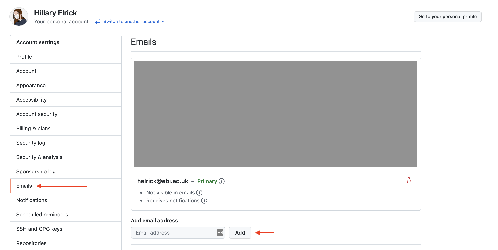
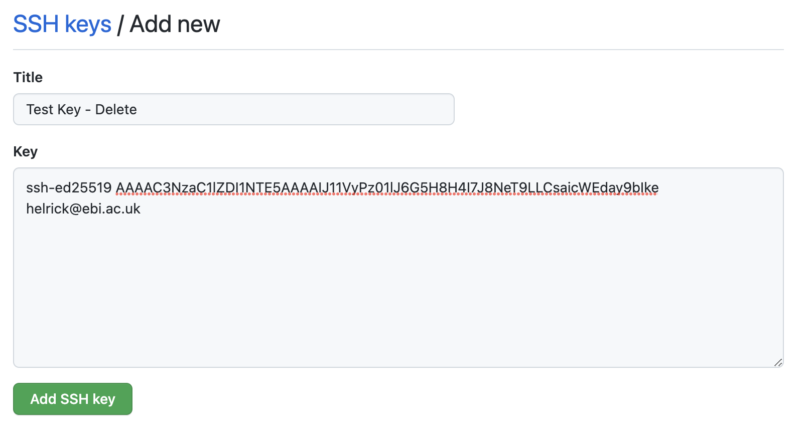
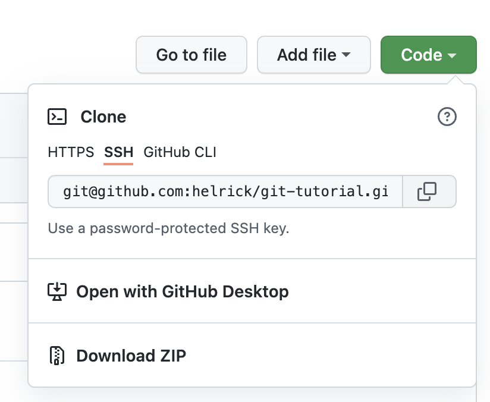
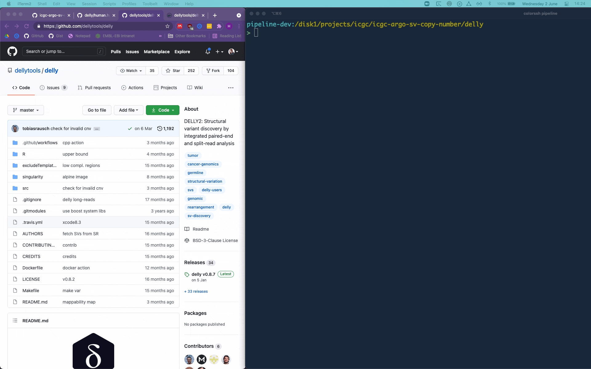
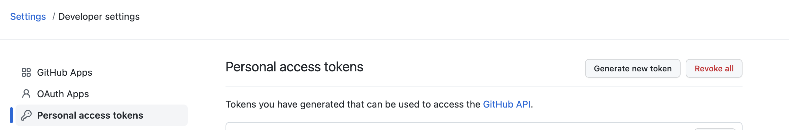
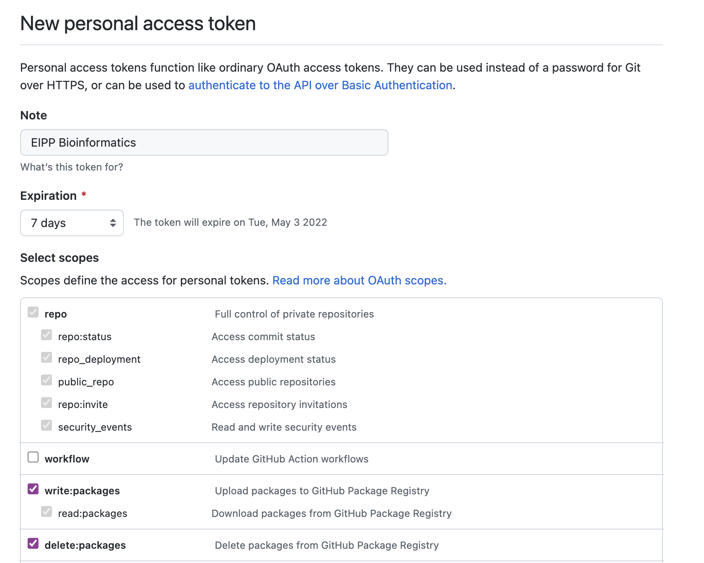
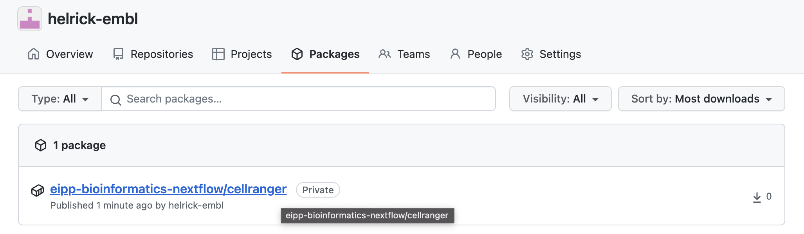

# 2022 Bioinformatics Nextflow Training

## Schedule:
[Git](#git)<br>
[Containers Background](https://docs.google.com/presentation/d/1ryzX9boyJXnyxCSkEHsRvndBIBjJj1V6ywaBQz0gk3Y/edit?usp=sharing)<br>
[Creating a Docker Image](#creating-a-docker-image)<br>
[Run with Test Data](#run-with-test-data)<br>
[Create Nextflow Pipeline](#create-nextflow-pipeline)

## Git
### Prerequisites
* GitHub account which you can log in to (please send me a slack message with this account)
* Record of an email associated to your GitHub account [settings](https://github.com/settings/emails). You should have access to the primary email on your account.

* Singularity >= v3.7
* Nextflow >= v21

### Set-up
 > **Background**: last summer, GitHub removed support for password authentication, requiring users to use a Personal Access Token (PAT) or to Authenticate with SSH. I prefer the SSH method, so that's what I'll be showing, though other options are possible. This method requires you to generate an SSH-key for every machine from which you'll push code to GitHub (i.e. the cluster, your laptop, any VM). It also requires that when you want to clone a repository, you'll need to  copy a repository's URL (to clone it), you'll need to copy the SSH link rather than the HTTPS link (don't worry if none of this makes sense, we'll go over it).

1) Log into the VM (see course instructions for this)

2) Open the Terminal, and on the command-line run:
    ```bash
    mkdir -p ~/.ssh && cd ~/.ssh
    ssh-keygen -t ed25519 -f github_key -C "<your_github_email@example.com>" -N ''
    cat ~/.ssh/github_key.pub
    ```
    Copy the output of the last command.
3) In a browser, go to your [GitHub SSH keys](https://github.com/settings/keys) and click 'New SSH key'

Enter a name (anything works but I prefer to give it a descriptive one based on the machine I've generated it on), and paste in the output of the previous command (your SSH public key).


4) Return to the VM and create an `~/.ssh/config` file via `touch ~/.ssh/config`. Open it with your favourite text editor (vim, nano, emacs) and paste in the following:
    ```bash
    Host github.com
        HostName github.com
            IdentityFile ~/.ssh/github_key
    ```
5) Set your local git user by running:
    ```bash
    git config --global user.email "<your_github_email@example.com>"
    git config --global user.name "<your-github-username>"
    ```
    The email must be associated to your GitHub account
6) Copy this repository's URL either from here -> `git@github.com:helrick/eipp-bioinformatics-nextflow.git` or by clicking the **Code** button on the top right of the repository:


7) Test cloning this repository on your VM:
    ```bash
    cd ~/Documents
    git clone git@github.com:helrick-embl/eipp-bioinformatics-nextflow.git
    ```
    This should create a folder, `eipp-bioinformatics-nextflow` in your `Documents` directory containing the code from this repo.
    
## Creating a Docker Image

This can be done several different ways, but in this example I'm adding the tool [Delly](https://github.com/dellytools/delly) with Docker

#### 3a) No Docker Image Available for Tool

If there's no Docker image available for your tool, you can use a "base image" of a Linux operating system and write the steps to install it. It will likely be an iterative process, similar to installing the tool on a brand new machine. You can test building until there are no missing dependencies.

Here is an example of a Dockerfile that installs Delly into an alpine-linux base image. I used alpine base image because it's a bit smaller than Ubuntu, but you can use any Linux distribution (or base image) that you prefer.

```Dockerfile
FROM alpine:latest

# add the dependencies 
# (apk is alpine's package manager, Ubuntu would be apt-get)
RUN apk update && \
    apk add --no-cache \
    bash util-linux coreutils \
    git curl \
    make cmake gcc g++ libstdc++ libgcc autoconf automake \
    zlib-dev curl-dev

# clone from the Delly repo & follow install instructions to make
RUN git clone --recursive https://github.com/dellytools/delly.git \
    && cd delly \
    && make all

# add the Delly tool to the image's path
ENV PATH="/delly/bin:${PATH}"

# default command executed
CMD ["/bin/sh"]
```

#### 3b) Docker Image _Is_ Available for Tool

In this example, Delly does have a [docker image available](https://hub.docker.com/r/dellytools/delly/tags?page=1&ordering=last_updated). If this is the case, you can use it as your "base" image and just add a label and default command like so:

```Dockerfile
FROM dellytools/delly:latest

CMD ["/bin/sh"]
```

### 4. Test Building Image

In both cases you can test building the Dockerfile when inside your tool's directory (in this case `/delly`) by running:
```bash
docker build -t ghcr.io/helrick-embl/eipp-bioinformatics-nextflow/delly:1.0 .
```
 > **The tag ghcr.io/helrick-embl/eipp-bioinformatics-nextflow/delly:1.0 refers to the container registry url, repository owner, repository name, the package name, and package version**

It should report any dependencies issues or syntax errors. Here is an example of a successful build of the Dockerfile from 3b.
```bash
> docker build .
Sending build context to Docker daemon  18.94kB
Step 1/4 : FROM dellytools/delly:latest
 ---> 5e497753dc56
Step 2/4 : LABEL org.opencontainers.image.source https://github.com/icgc-argo-structural-variation-cn-wg/icgc-argo-sv-copy-number
 ---> Using cache
 ---> bf5d202c124c
Step 3/4 : ENTRYPOINT ["/usr/bin/env"]
 ---> Using cache
 ---> 1b9a69d0a9b7
Step 4/4 : CMD ["/bin/sh"]
 ---> Using cache
 ---> 4abfb61e7e50
Successfully built 4abfb61e7e50
```
The image ID will be printed on the last line, in this case `4abfb61e7e50`. You can then test "spinning up" a docker container using you image like so:
```bash
docker run --rm -it <image-id>
```

This is similar conceptually to creating a virtual machine from a base operating system. Since the final `CMD` line instructs the image to execute `/bin/sh`, that's what will be executed when you build the container from the image.

From within the container you can run your tool command, in this case `delly` and ensure that the program is installed correctly.

The `--rm` flag means that you don't want to keep the container around after you exit it. To exit the container you can simply run `exit`.



### 5. Publish Image on GitHub Container Registry

#### 5.1 Generate PAT

Go to [https://github.com/settings/tokens](https://github.com/settings/tokens) and click "Generate new token"



Enter a note and select:
* write:packages
* read:packages
* delete:packages



Copy the PAT shown on your screen. Save it in a command-line variable, `$CR_PAT` like so:
```bash
CR_PAT=<paste-key-here>
```
and test that it was saved correctly by:
```bash
echo $CR_PAT
```
You should now be able to authenticate to the GitHub container registry via:
```bash
echo $CR_PAT | docker login ghcr.io -u <github-username> --password-stdin
```
#### 5.2 Push your image

You can now push you image via:
```bash
docker push ghcr.io/helrick-embl/eipp-bioinformatics-nextflow/delly:1.0
```
It should be visible at [https://github.com/orgs/helrick-embl/packages](https://github.com/orgs/helrick-embl/packages):



# Run with Test Data

You can download a publicly-available PBMC data set from the 10x Genomics and extract it via:
```bash
mkdir data && cd data
wget https://cf.10xgenomics.com/samples/cell-exp/3.0.0/pbmc_1k_v3/pbmc_1k_v3_fastqs.tar
tar -xvf pbmc_1k_v3_fastqs.tar
```

A transcriptome reference is also provided by 10x Genomics which you can download and extract via:
```bash
wget https://cf.10xgenomics.com/supp/cell-exp/refdata-cellranger-GRCh38-3.0.0.tar.gz
tar -zxvf refdata-cellranger-GRCh38-3.0.0.tar.gz
```
We will run with singularity on the command-line first. First you should set your URI variable to point to the image that you've pushed to ghcr. In this example, a cellranger image:
```bash
uri=docker://ghcr.io/helrick-embl/eipp-bioinformatics-nextflow/cellranger:1.0
```

We can then run the image with singularity via:
```bash
singularity -s exec "$uri" cellranger count --id=run_count_1kpbmcs --fastqs=./data/pbmc_1k_v3_fastqs --sample=pbmc_1k_v3 --transcriptome=./data/refdata-cellranger-GRCh38-3.0.0
```

 > **Background**: If you don't have docker on the machine you'd like to run on, you can set a command for singularity to login to docker like so: `SINGULARITY_DOCKER_LOGIN="echo $CR_PAT | docker login ghcr.io -u <github-username> --password-stdin"`

# Create Nextflow Pipeline

Once you've tested that you're able to run the image with Singularity, you can create a Nextflow pipeline to run the test data. By creating a `main.nf` file containing:
```groovy
nextflow.enable.dsl = 2

params.id = ""
params.fastqs = ""
params.sample = ""
params.transcriptome = ""

process cellranger {

	container "ghcr.io/helrick-embl/eipp-bioinformatics-nextflow/cellranger:1.0"
	//container "/home/training/Documents/eipp-bioinformatics-nextflow/cellranger_1.0.sif"
	memory "16 GB"

	input:
		val id
		path fastqs
		val sample
		path transcriptome	
	output:
		path "outs/*"
	
	script:
	"""
	cellranger count \
	--id=${id} --fastqs=${fastqs} --sample=${sample} \
	--transcriptome=${transcriptome}
	"""
}

workflow {
	cellranger(params.id, params.fastqs, params.sample, params.transcriptome)
}
```
